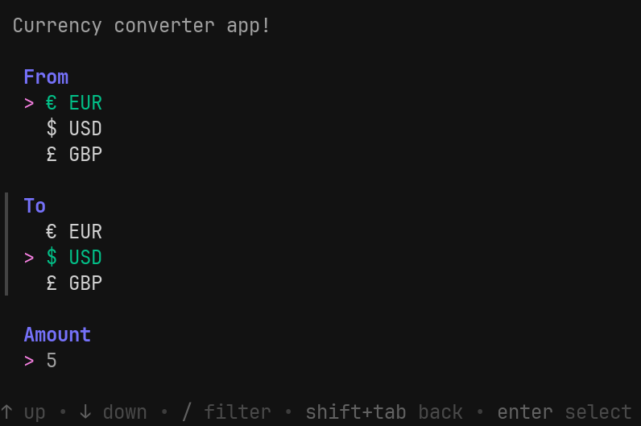

# Currency converter written in Go.
[idea taken from](https://youtu.be/gXmznGEW9vo?si=DXf61nw6zoxXEJC_&t=590)

## Motivation
The motivation behind this project is to learn Go and understand how web APIs work for my future projects.

## How to run
1. Clone repository ```git clone https://github.com/kamilkonefke/currency_converter```
2. Get your **app id** from [here](https://openexchangerates.org/).
3. Create ```.env``` file in project directory.
4. In ```.env``` add ```APP_ID=your_key``` line.
5. And run it. ```go run .```

# Showcase

